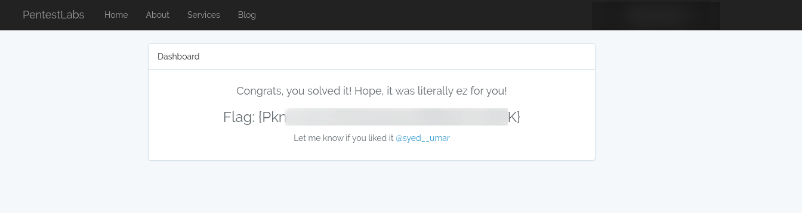

# Admin Panel Takeover - I

## Description

The application is utilizing Laravel \(~5\) to create/edit/remove posts in a blog type environment. The admin/dev currently doesn't have knowledge to hide something utilizing PHP code and that information could be utilized by an attacker to takeover the Admin Panel and deface/defame/edit the application. 

Also, the challenge isn't to be solved with brute-forcing credentials The difficulty depends upon ones knowledge/skills, solving it could take _20 minutes_ to _2-3_ hours. 

## Usage/Installation:

You can download and run the [docker](https://docker.com) image utilizing the following one liner: 

```bash
sudo docker run -it --rm uexpl0it/admin-panel-takeover
```

Or you can build the docker image using the following `DockerFile`:

```bash
FROM ubuntu:18.04
ENV DEBIAN_FRONTEND=noninteractive

RUN apt-get update
RUN apt-get install -y mysql-server git net-tools php7.2 \
	php7.2-fpm \
	php7.2-common \
	php7.2-pdo \
	php7.2-mysqli \
	php7.2-mbstring \
	php7.2-xml \
	php7.2-json \
	php7.2-phar \
	php7.2-zip \
	php7.2-gd \
	php7.2-dom

RUN git clone https://github.com/Anon-Exploiter/adminPanelTakeover /root/adminPanelTakeover
WORKDIR /root/adminPanelTakeover

CMD ["bash", "-c", "/bin/bash run.sh"]
```

## Goal:

The end goal of the application is to grab the flag in the dashboard after successfully accessing the admin panel. Will try to post the detailed solution with fixes next weekend. 



## Credits:

Thanks to my colleagues from Ebryx for helping in the beta-testing. Also, the Laravel application's base was cloned from Traversy Media's [Github](https://github.com/bradtraversy/lsapp) page.

