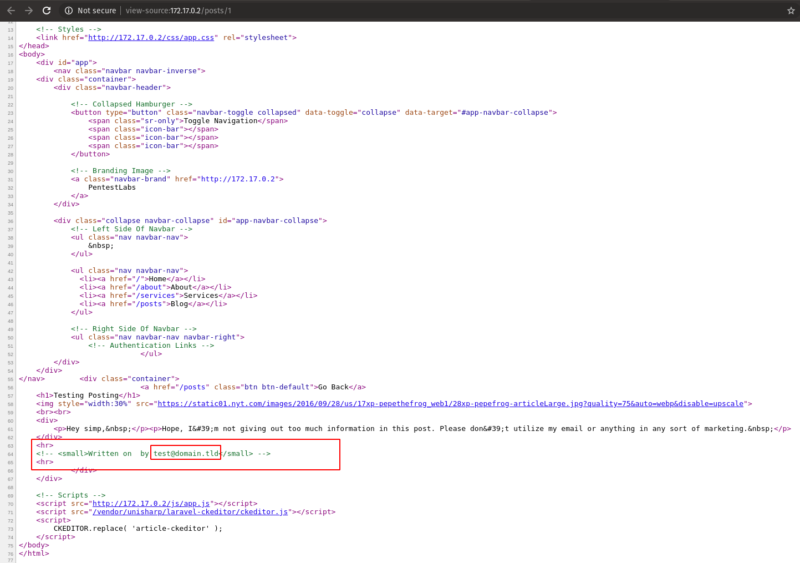

# Solution \(A-01\)

## Solution

Hey everyone, 

Thanks for taking out the time to solve the [challenge \(Admin Panel Takeover - I\)](https://pentestlabs.gitbook.io/challenges/admin-panel-takeover-i). I'll try to write a thorough walkthrough and solution of the CTF including the misconfiguration/flaw, remediation and some cool references. Let's jump into it. 

As mentioned in the [link](https://pentestlabs.gitbook.io/challenges/admin-panel-takeover-i) above^^, the challenge can be deployed with the following one liner:

```bash
sudo docker run -it --rm uexpl0it/admin-panel-takeover
```

After running the above docker command and if everything went well, you'll get the following IP printed in the terminal:


So, the first step would be to enumerate the application and find out all the possible information we can extract while remaining passive. The information can include, the backend server, OS, programming langauge, CMS, framework, etc. 

For that, we can utilize [Wappalyzer](https://github.com/AliasIO/wappalyzer). It's an extension available in different browsers which aids in information gathering \(won't go in depth of advantages\). 

So, it found out that the application is running on [Laravel](https://laravel.com/) \(based on the cookies attributes\), the backend programming language is [PHP 7.2.24](https://www.php.net/releases/7_2_24.php) and the underlying OS \(docker image\) is based on [Ubuntu](https://hub.docker.com/_/ubuntu/).


Let's continue with the enumeration and visit every page in the application and see if we can find anything interesting.


Okay, so the first post contains something interesting in the footer of the page, there are two straight lines without having anything in-between. Maybe the admin wanted to hide something in the page and just commented it out in HTML and didn't remove it? Let's take a look. 



So, the [&lt;hr&gt;](https://www.w3schools.com/tags/tag_hr.asp) tag did actually contain an email address in the source \(test@domain.tld\). But where can we use it? There wasn't any link to login page in the whole application. Maybe time to actively scan? Before that, let's see if the application has [robots.txt](https://support.google.com/webmasters/answer/6062608?hl=en) and any sensitive content in it. 


Robots.txt doesn't have anything sensitive or something to help us with, maybe it's time to find directories/API endpoints. We can use variety of tools for that purpose \(i.e. [gobuster](https://github.com/OJ/gobuster), [dirsearch](http://github.com/maurosoria/dirsearch), [dirb](https://tools.kali.org/web-applications/dirb), [dirbuster](https://tools.kali.org/web-applications/dirbuster)\). 

I'll be using [dirsearch](http://github.com/maurosoria/dirsearch) since it has recursiveness, threadding, own wordlist, custom headers inclusion, etc. My second preference would be [gobuster](https://github.com/OJ/gobuster) because of it's insane speed. 

```bash
user@b0x:~$ python3 dirsearch.py -e php -t 100 -u http://172.17.0.2

 _|. _ _  _  _  _ _|_    v0.3.9
(_||| _) (/_(_|| (_| )

Extensions: php | HTTP method: get | Threads: 100 | Wordlist size: 6031

Error Log: /home/user/tools/dirsearch/logs/errors-20-05-02_17-54-49.log

Target: http://172.17.0.2

[17:54:49] Starting: 
[17:54:50] 200 -  553B  - http://172.17.0.2:80/.htaccess
[17:54:50] 200 -    2KB - http://172.17.0.2:80/.htaccess/
[17:54:51] 200 -    3KB - http://172.17.0.2:80/about
[17:54:57] 200 -    0B  - http://172.17.0.2:80/favicon.ico
[17:54:59] 200 -    2KB - http://172.17.0.2:80/index.php
[17:55:00] 405 -   25KB - http://172.17.0.2:80/logout
[17:55:00] 405 -   25KB - http://172.17.0.2:80/logout/
[17:55:02] 200 -    3KB - http://172.17.0.2:80/posts
[17:55:02] 200 -   24B  - http://172.17.0.2:80/robots.txt
[17:55:03] 200 -    2KB - http://172.17.0.2:80/services
[17:55:03] 200 -    4KB - http://172.17.0.2:80/showadmin
[17:55:05] 200 -  914B  - http://172.17.0.2:80/web.config

Task Completed
```


So, the scanning was fruitful and we were able to find out some interesting files/directories, let's go by them, one by one. 


[.htaccess](http://172.17.0.2/.htaccess) doesn't contain anything useful. In case you want to know about the rules, here's a good [guide](https://www.whoishostingthis.com/resources/htaccess/) on it. Let's continue with the rest. 

Next in the list is Logout endpoint, it returns [405 HTTP Response Code](https://developer.mozilla.org/en-US/docs/Web/HTTP/Status/405) in the dirsearch scan results \(which indicates the request method isn't allowed i.e. GET\). Let's give this page a visit.


Cool, it seems the laravel application in it's current production state has debugging enabled, but it is only disclosing Full Path of the application \(highlighted in [Figure 8](https://gblobscdn.gitbook.com/assets%2F-M5GzoOQsFytHoAwkBJ4%2F-M6KOnyC2ZAZzRDEEWk_%2F-M6KUk1t8Zbx0HmpSdsJ%2Fimage.png?alt=media&token=3b7c6533-f5c2-46d8-8a6a-42e84b03114a)\) and nothing interesting. The FPD itself could be utilized with LFI or LFD, but we haven't come across any. 

For now, let's continue with the dirsearch results and while keeping in mind the above misconfiguration. The next in the list is [`showadmin`](http://172.17.0.2/showadmin) endpoint. 


So, the [showadmin](http://172.17.0.2/showadmin) endpoint seems to have a login page on it. Maybe we can utilize the `email` we discovered before and launch a credentials brute-force attack? Before doing something which will generate noise, let's vist the feature `Forgot Your Password?`


Okay, that's cool, we can utilize this forget password [endpoint](http://172.17.0.2/showadmin/password/reset) with the email we found earlier and try our luck, maybe?  


So, it seems an exception occured because of SMTP/Swift not being configured properly. Looking at the exception page, the backend email/function is being disclosed. 

Taking another look at the page, at the bottom in MainChannel.php line 80, it seems the exception is disclosing the array formed at the backend, which was going to be utilized in the email content.


There's a `actionUrl` key in the array containing a URL with a long `hash`, let's open the URL and check the contents of the page. 


Yayy, that was the thing we were looking for, because of **debugging** **being turned** **on**, we were able to see the `array` and the `password reset hash` which resulted in the `reset password page`. Let's try resetting our password. 


So, that was it, the final thing was to grab the flag. After resetting the password, the application auto-logins. 

**Thank you very much** for reading it till the end \(if you did, lol\). Hopefully see you in the next challenges :\)

